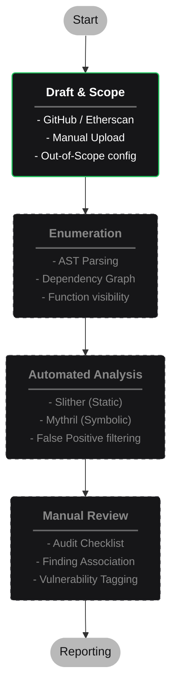

# SolAudity

**Intelligent Audit Management Platform for EVM Smart Contracts**

Solaudity is a comprehensive solution designed to streamline the lifecycle of smart contract security audits. From scope definition to final reporting, it provides a structured environment for auditors to manage their missions effectively, leveraging automated tools and manual review workflows.

<br>

## Goal

The primary goal of Solaudity is to centralize and optimize the smart contract auditing process. It aims to:
-   **Simplify Scope Management**: Easily import contracts from various sources (GitHub, Etherscan, etc.).
-   **Automate Enumeration**: Quickly visualize contract structures and dependencies.
-   **Integrate Analysis Tools**: Seamless execution of static (Slither) and symbolic (Mythril) analysis.
-   **Leverage AI**: Extract audit metadata from free text using multi-provider LLM integration.
-   **Structure Manual Reviews**: Provide checklists and finding management to ensure thoroughness.
-   **Generate Reports**: Automatically produce professional Markdown and PDF reports.

<br>

## Technical Stack

Built with modern, performance-oriented technologies.

| Component | Technology | Description |
| :--- | :--- | :--- |
| **Frontend** |   | **Vite**, **PandaCSS**, **Ark UI**, **Lucide React** for a responsive and accessible UI. |
| **Backend** |   | High-performance Python API with **SQLModel** + **SQLite** and **Alembic** migrations. |
| **AI** |   | Multi-provider LLM support: **OpenAI**, **Groq**, **XAI (Grok)**, **Google Gemini**. |
| **Deployment** |  | Containerized environment with dev/prod profiles and Docker Compose. |

<br>

## Key Features

### 1. Authentication & User Management
- **JWT Authentication**: Secure registration and login with bcrypt password hashing.
- **User Profile**: Update email, configure AI provider and API key, manage Etherscan API key.
- **Data Isolation**: Users can only access their own audits and scope data.

### 2. Audit Management
- **Full CRUD**: Create, list, update, pin/unpin, mark-opened, and delete audit missions.
- **Dashboard**: Real-time statistics cards with live audit data aggregation.
- **Filtering**: Search by title, filter by status, chain, network, or pinned state.
- **AI Metadata Extraction**: Paste free text and let an LLM auto-fill audit fields (title, description, chain, dates, etc.).

### 3. Scope Definition
- **Sources**: Import contracts from multiple origins:
  - `GitHub` repositories (clone by branch or commit)
  - Block explorers: `Etherscan`, `Arbiscan`, `Polygonscan`, `BSCScan`, `BaseScan`, `Optimism`
  - `Bug Bounty` platforms
  - Manual `.sol` file uploads
- **Contracts**: Upload, view source, toggle in-scope/out-of-scope with reason tracking.
- **Addresses**: Register on-chain addresses with type classification (deployment, proxy, implementation, role, token, external). Auto-checks verification status and fetches bytecode via Etherscan API.

### 4. Enumeration & Visualization *(planned)*
- **Parsing**: Structural analysis of contracts (Functions, Events, State Variables) via Slither.
- **Dependency Graph**: Visual representation of contract interactions.
- **Filtering**: Advanced search and filtering by visibility, modifiers, etc.

### 5. Automated Analysis *(planned)*
- **Static Analysis**: Run Slither automatically.
- **Symbolic Execution**: Run Mythril for deeper checks.
- **Validation**: Review findings and mark false positives.

### 6. Manual Review & Reporting *(planned)*
- **Checklists**: Follow standard audit methodologies.
- **Findings**: Create, tag, and associate findings with specific code.
- **Reports**: Generate publication-ready Markdown and PDF reports.

<br><br>

## Workflow



> **Legend**: Solid green border = implemented | Dashed gray border = planned

<br><br>

## Getting Started

### Prerequisites
*   [Docker](https://www.docker.com/) and Docker Compose installed.

### Installation

1.  **Clone the repository**
    ```bash
    git clone https://github.com/Solaudity-Corp/solaudity.git
    cd solaudity
    ```

2.  **Start in Development Mode**
    Runs the backend and frontend with live reload.
    ```bash
    ./start.sh dev
    ```
    -   Frontend: [http://localhost:5173](http://localhost:5173)
    -   Backend: [http://localhost:8001](http://localhost:8001)

3.  **Start in Production Mode**
    ```bash
    ./start.sh prod
    ```

### Stopping / Cleanup

```bash
./stop.sh              # Stop all containers
./delete.sh            # Remove all containers, volumes, and images
```

<br>

## Testing

Run tests via the interactive test runner:

```bash
./test.sh              # Interactive menu
./test.sh frontend     # Frontend unit tests (Vitest in Docker)
./test.sh backend      # Backend unit tests (Pytest in Docker)
./test.sh all          # Both unit test suites
./test.sh smoke        # Post-upgrade integration tests (full stack)
./test.sh full         # Unit + smoke tests
```

The smoke tests build production images, spin up the full stack, and exercise every API surface (auth, CRUD, scope management, error handling, frontend serving).
