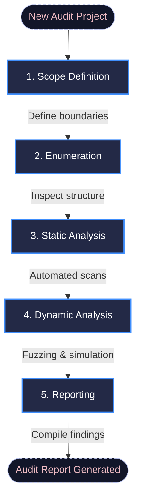

# Solaudity

Solaudity is a unified, self-hosted workstation designed to simplify and structure smart contract security audits. Instead of juggling multiple tools, terminals, and documents, it provides a centralized interface to run analysis tools, browse contract code, track vulnerabilities, and generate professional reports.

The platform organizes each audit into five distinct phases, ensuring consistency, thoroughness, and structural tracking from start to finish.

---

## The Audit Workflow



### 1. Scope Definition
Establish the audit boundaries at the beginning of the project. Import smart contracts directly from GitHub, block explorers (Etherscan, Arbiscan, and others), or via manual file uploads. Register on-chain deployment addresses and document excluded files with justifications to maintain a clear record of the scope.

### 2. Enumeration
Gain a deep structural understanding of the target codebase before searching for vulnerabilities. Visualize and inspect:
* Functions and state variables
* Inheritance hierarchies and relationships
* Events and execution call graphs

### 3. Static Analysis
Run automated tools directly from the web interface. Static analysis tools quickly detect common vulnerability patterns and generate an initial set of findings. The interface allows you to review each finding, dismiss false positives, and validate critical issues.

### 4. Dynamic Analysis
Execute advanced tools to simulate runtime behavior, perform fuzzing, or run formal verification. While slower, dynamic analysis checks complex logic paths and edge cases to find deep vulnerabilities that static tools miss.

### 5. Reporting
Compile all verified findings, context, and audit summaries collected during the previous phases. Solaudity automatically assembles this data into a structured, professional report ready for delivery.

---

## Installation and Quick Start

### Requirements
* Docker
* Docker Compose

### Commands

Clone the repository and run the startup script:

```bash
git clone https://github.com/Solaudity-Corp/solaudity.git
cd solaudity

# Start in development mode (with live reload)
./start.sh dev

# Start in production mode
./start.sh prod
```

> [!NOTE]
> The initial build may take several minutes as it downloads and configures the required analysis tools. Subsequent starts will be fast.

### Services
Once the services are running, access the interfaces at:
* **Frontend:** http://localhost:5173
* **Backend:** http://localhost:8001

---

## Configuration

Two optional API keys can be configured directly in your user profile after logging in (no environment configuration required):

* **Etherscan API Key:** Enables direct smart contract imports from block explorers (Etherscan, Arbiscan, Polygonscan, etc.).
* **AI Provider Key:** Enables automatic metadata extraction. This feature parses free-text audit briefs and automatically populates structured audit fields. Supported providers include OpenAI, Groq, xAI, and Gemini.

---

> [!WARNING]
> **Important Security Notice**
> Do not expose the Solaudity service to the public internet. While the application requires authentication, it is designed strictly for local or internal network use. To run analysis tools, the application gives authenticated users access to system-level execution capabilities. Exposing this workstation publicly represents a critical security risk.

---

## Testing

Ensure Docker is running and ports `8001` and `5173` are free before running the tests.

| Command | Scope | Description |
| :--- | :--- | :--- |
| `./test.sh` | Interactive Menu | Launches an interactive CLI helper to select and run tests. |
| `./test.sh 1` | Unit Tests | Executes the backend and frontend unit test suites. |
| `./test.sh 2` | API Security | Verifies API authorization, access controls, and authentication routes. |
| `./test.sh 3` | Appsec Suite | Runs both the unit tests and the API security tests. |
| `./test.sh 4` | Smoke Test | Performs a full end-to-end integration test: builds images, starts the stack, exercises all API endpoints, and cleans up. |
| `./test.sh 5` | Complete Run | Runs all available tests sequentially. |

---

## Management and Cleanup

Use the helper scripts to stop the application or clean up local Docker resources:

* **Stop Services:** Keep all configuration and data intact.
  ```bash
  ./stop.sh
  ```
* **Full Reset:** Destroy all containers, networks, volumes, and built images.
  ```bash
  ./delete.sh
  ```
