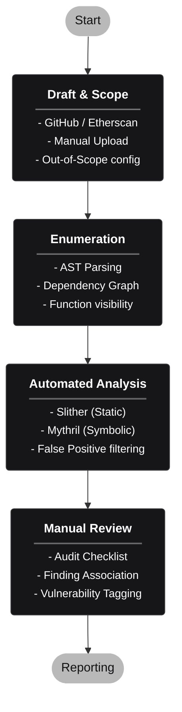

# SolAudity

**Intelligent Audit Management Platform for EVM Smart Contracts**

Solaudity is a comprehensive solution designed to streamline the lifecycle of smart contract security audits. From scope definition to final reporting, it provides a structured environment for auditors to manage their missions effectively, leveraging automated tools and manual review workflows.

<br>

## Goal

The primary goal of Solaudity is to centralize and optimize the smart contract auditing process. It aims to:
-   **Simplify Scope Management**: Easily import contracts from various sources (GitHub, Etherscan, etc.).
-   **Automate Enumeration**: Quickly visualize contract structures and dependencies.
-   **Integrate Analysis Tools**: seamless execution of static (Slither) and symbolic (Mythril) analysis.
-   **Structure Manual Reviews**: Provide checklists and finding management to ensure thoroughness.
-   **Generate Reports**: Automatically produce professional Markdown and PDF reports.

<br>

## Technical Stack

Built with modern, performance-oriented technologies.

| Component | Technology | Description |
| :--- | :--- | :--- |
| **Frontend** |   | **Vite**, **PandaCSS**, **Ark UI**, **Lucide React** for a responsive and accessible UI. |
| **Backend** |   | High-performance Python API for handling logic and integrations. |
| **Analysis** |   | Integration with industry-standard security tools. |
| **Deployment** |  | Containerized environment for easy setup and reproducibility. |

<br>

## Key Features

### 1. Audit Management
- **Lifecycle**: Create, list, delete, and resume audit missions.
- **Dashboard**: Centralized view of all ongoing security assessments.

### 2. Scope Definition
- **Flexible Import**:
  - `GitHub` repositories
  - `Etherscan` verified contracts
  - `Bug Bounty` platforms
  - Manual `.sol` uploads
- **Out-of-Scope**: Clearly define what is excluded from the audit.

### 3. Enumeration & Visualization
- **Parsing**: Structural analysis of contracts (Functions, Events, State Variables) via Slither.
- **Dependency Graph**: Visual representation of contract interactions.
- **Filtering**: Advanced search and filtering by visibility, modifiers, etc.

### 4. Automated Analysis
- **Static Analysis**: Run Slither automatically.
- **Symbolic Execution**: Run Mythril for deeper checks.
- **Validation**: Review findings and mark false positives.

### 5. Manual Review & Reporting
- **Checklists**: Follow standard audit methodologies.
- **Findings**: Create, tag, and associate findings with specific code.
- **Reports**: Generate publication-ready Markdown and PDF reports.

<br><br>

## Workflow



<br><br>

## Getting Started

### Prerequisites
*   [Docker](https://www.docker.com/) and Docker Compose installed.

### Installation

1.  **Clone the repository**
    ```bash
    git clone https://github.com/yourusername/solaudity.git
    cd solaudity
    ```

2.  **Start in Development Mode**
    Runs the backend and frontend with live reload.
    ```bash
    ./start.sh dev
    ```
    -   Frontend: [http://localhost:5173](http://localhost:5173)
    -   Backend: [http://localhost:8001](http://localhost:8001)

3.  **Start in Production Mode**
    ```bash
    ./start.sh prod
    ```